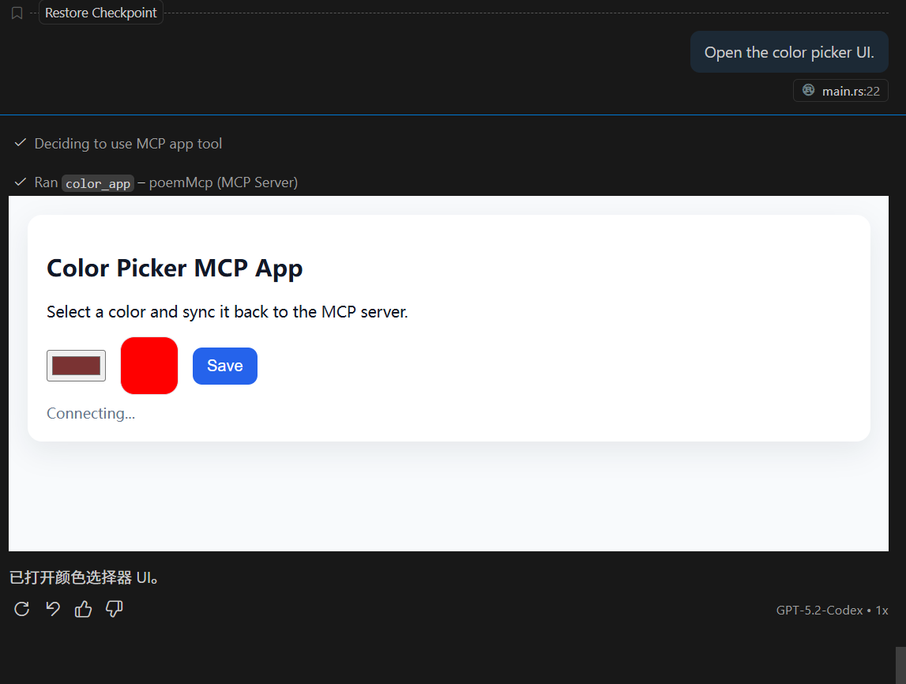

# MCP Apps UI Example

This example demonstrates MCP Apps using `poem-mcpserver` with a static UI resource.
The UI is bundled as an HTML file and uses `@modelcontextprotocol/ext-apps`.

## What it does

- Exposes a tool with `_meta.ui.resourceUri` (`ui://apps/color-picker`).
- Serves the UI resource via `resources/read`.
- Lets the UI call back into the server to set/get a color.

## Run the server

From the repository root:

- `cargo run -p apps-ui`

Then connect your MCP host to the server over stdio and invoke `color_app`.
The host should render the UI and allow interactive updates.

## Image

