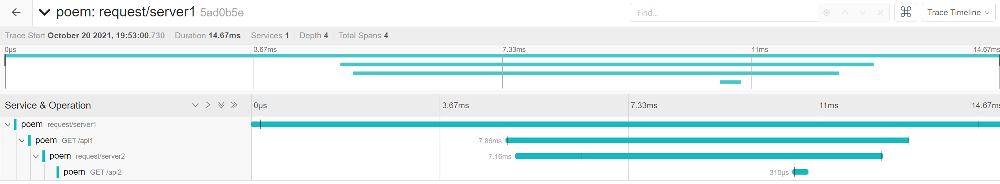

# Quickstart

First make sure you have a running version of the Jaeger instance you want to send data to:

```shell
docker run -e COLLECTOR_OTLP_ENABLED=true -p 4317:4317 -p 4318:4318 -p16686:16686 -p14268:14268 jaegertracing/all-in-one:latest
```

Launch the servers:

```shell
cargo run --bin example-opentelemetry-server1
```

```shell
cargo run --bin example-opentelemetry-server2
```

Send a request from the client:

```shell
cargo run --bin example-opentelemetry-client
```

Open `http://localhost:16686/` in the browser, you will see the following picture.


